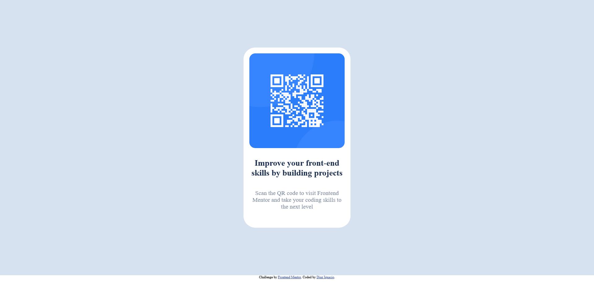

# Frontend Mentor - QR code component solution

This is a solution to the [QR code component challenge on Frontend Mentor](https://www.frontendmentor.io/challenges/qr-code-component-iux_sIO_H). Frontend Mentor challenges help you improve your coding skills by building realistic projects. 

## Table of contents

  - [Screenshot](#screenshot)
  - [Links](#links)
  - [Built with](#built-with)
- [Author](#author)

### Screenshot

### Links

- Solution URL: [Add solution URL here](https://github.com/informaticadiaz/qr-code-component)
- Live Site URL: [Add live site URL here](https://informaticadiaz.github.io/qr-code-component/)

### Built with

- Semantic HTML5 markup
- CSS custom properties

## Author

- Website - [Diaz Ignacio](https://www.diazignacio.ar)
- Frontend Mentor - [@informaticadiaz](https://www.frontendmentor.io/profile/informaticadiaz)
- Twitter - [@DiazIgnacioDev](https://twitter.com/DiazIgnacioDev)
